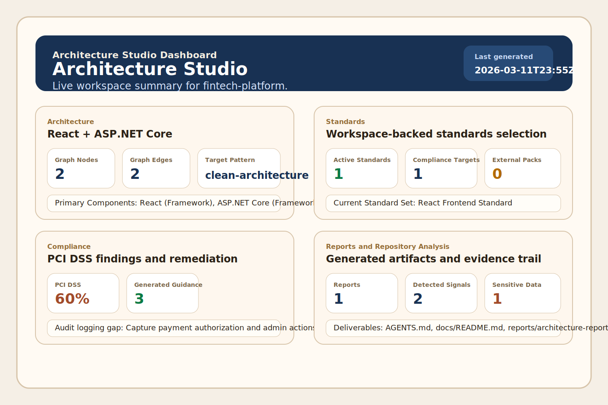

# Dashboard

## What It Is

The Architecture Studio dashboard is the main workspace surface for the extension. It now lives in the VS Code Activity Bar as its own `Architecture Studio` sidebar entry, so you can keep the tool open like any other first-class workspace view.

The dashboard currently includes:

- Architecture
- Standards
- Compliance
- Reports
- Repository Analysis

## What You Can Expect

The dashboard now builds its state from the active workspace instead of sample content. When a folder is open, the cards and detail panels reflect live engine output for architecture, standards, compliance, reports, and repository analysis. When no folder is open, the dashboard stays explicit and tells you to open a workspace instead of silently showing stale or fake values.

Each section is intended to give you:

- a quick summary of current status
- a focused list of details to review
- action buttons that route back into the matching extension command
- deterministic refresh behavior when you reopen the sidebar or trigger a dashboard action

## Why It Matters

This view is the foundation for the product experience and the GitHub Pages story. It gives users a single, visual explanation of what Architecture Studio can do:

- reason about architecture choices
- compose standards
- surface compliance risk
- summarize reports
- inspect repository analysis evidence

The compliance section can now render score cards in the same style the product vision calls for, such as `HIPAA 72%`.

## Current Status

The current dashboard story now delivers:

- an Activity Bar entry and sidebar-hosted dashboard view
- the packaged webview shell and typed message bridge
- live workspace-backed section content
- explicit no-workspace and no-data empty states
- refresh after dashboard-triggered commands

Use the `Architecture Studio` item in the left sidebar, then run `Architecture Studio: Open Dashboard` any time you want VS Code to focus that view for you. Use the sample fintech fixture or your own workspace to see the live cards and evidence panels populate.
